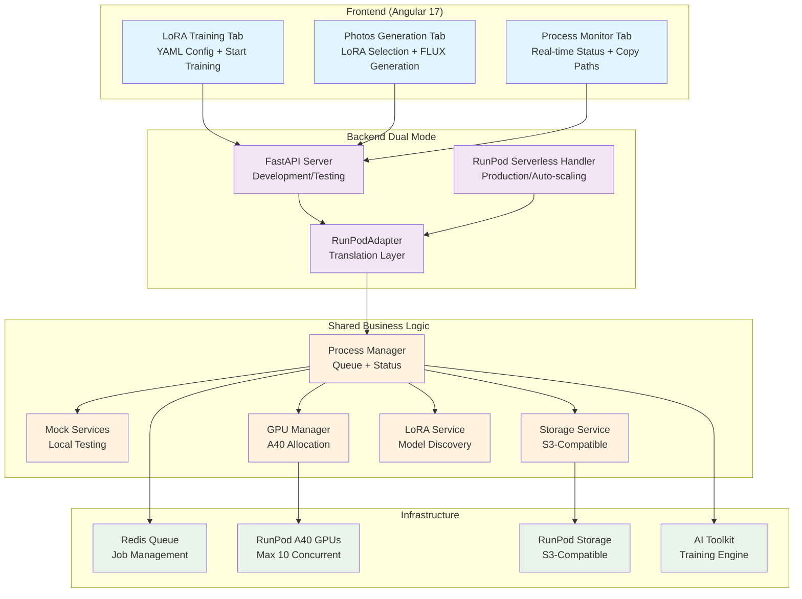

# LoRA Dashboard - Serverless Training & Generation Suite

A production-ready, serverless dashboard for LoRA (Low-Rank Adaptation) model training and image generation using FLUX.1-dev. Built with Angular 17 frontend and FastAPI backend, designed for RunPod serverless deployment.

## 🏗️ **NOWA ARCHITEKTURA - DUAL MODE**

**Backend wspiera 2 tryby działania:**


```mermaid
graph TB
    subgraph "Frontend (Angular 17)"
        A[LoRA Training Tab<br/>YAML Config + Start Training]
        B[Photos Generation Tab<br/>LoRA Selection + FLUX Generation]
        C[Process Monitor Tab<br/>Real-time Status + Copy Paths]
    end
    
    subgraph "Backend Dual Mode"
        D[FastAPI Server<br/>Development/Testing]
        E[RunPod Serverless Handler<br/>Production/Auto-scaling]
        F[RunPodAdapter<br/>Translation Layer]
    end
    
    subgraph "Shared Business Logic"
        G[Process Manager<br/>Queue + Status]
        H[Mock Services<br/>Local Testing]
        I[GPU Manager<br/>A40 Allocation]
        J[Storage Service<br/>S3-Compatible]
        K[LoRA Service<br/>Model Discovery]
    end
    
    subgraph "Infrastructure"
        L[Redis Queue<br/>Job Management]
        M[RunPod A40 GPUs<br/>Max 10 Concurrent]
        N[RunPod Storage<br/>S3-Compatible]
        O[AI Toolkit<br/>Training Engine]
    end
    
    A --> D
    B --> D
    C --> D
    
    D --> F
    E --> F
    F --> G
    
    G --> H
    G --> I
    G --> J  
    G --> K
    G --> L
    
    I --> M
    J --> N
    G --> O
    
    classDef frontend fill:#e1f5fe
    classDef backend fill:#f3e5f5
    classDef shared fill:#fff3e0
    classDef infra fill:#e8f5e8
    
    class A,B,C frontend
    class D,E,F backend
    class G,H,I,J,K shared
    class L,M,N,O infra
```

**Korzyści Dual Mode:**
- ✅ **Development**: Szybkie testowanie z FastAPI + Mock Services
- ✅ **Production**: RunPod Serverless auto-scaling  
- ✅ **Unified**: Ta sama logika biznesowa w obu trybach
- ✅ **Frontend**: Bez zmian - kompatybilność API zachowana

## ✨ Features

### 🎯 **Core Functionality**
- **🏗️ Dual Mode Architecture**: FastAPI (dev) + RunPod Serverless (prod)
- **🧪 Mock Services**: Pełne testowanie lokalnie bez zewnętrznych dependencies
- **📝 LoRA Training**: YAML konfiguracja + Start Training przycisk
- **🖼️ Photos Generation**: FLUX image generation z LoRA models
- **📊 Real-time Monitoring**: Auto-refresh process monitor z copy paths
- **🔄 Auto-scaling**: RunPod Serverless z GPU on-demand

### 🛡️ **Security & Performance**
- **🔐 Authentication**: Wyłączone w development, configurable
- **🌐 CORS Configuration**: Production-ready dla frontend-backend
- **💾 Health Checks**: Comprehensive monitoring + status endpoints
- **💰 Cost Controls**: Budget limits + auto-scaling policies
- **🚀 Optimized Performance**: Mock services dla development speed

### 🚀 **Deployment Options**
- **💻 Local Development**: FastAPI + Mock Services
- **☁️ RunPod Serverless**: Auto-scaling production deployment  
- **🎯 RunPod Hub**: Community marketplace ready (hub.json + tests.json)
- **🐳 Docker**: Containerized dla łatwego deployment
- **📋 Multiple GPU Types**: A40, RTX A6000, A100 support

## 🚀 **Quick Start**

### **🧪 Local Development (Recommended)**

```bash
# 1. Start Backend (Mock Mode)
cd "Serverless/Backend"
copy mock_config.env .env
python -m uvicorn app.main:app --reload --port 8000

# 2. Start Frontend (nowy terminal)  
cd "Serverless/Front/lora-dashboard"
npm install
npm start

# 3. Test aplikacji
# Frontend: http://localhost:4200
# Backend:  http://localhost:8000/api/health
```

### **☁️ RunPod Serverless Deployment**

```bash
# 1. Build Docker image
cd "Serverless/Backend" 
docker build -t your-registry/lora-dashboard-backend:latest .
docker push your-registry/lora-dashboard-backend:latest

# 2. Deploy na RunPod (zobacz RUNPOD_DEPLOYMENT_GUIDE.md)
# 3. Update frontend environment.prod.ts z RunPod endpoint URL
```

### **📚 Kompletne Guide'y**

| Guide | Opis | Kiedy używać |
|-------|------|--------------|
| **[LOCAL_MOCK_TESTING_GUIDE.md](Serverless/Backend/LOCAL_MOCK_TESTING_GUIDE.md)** | Mock testing frontend ↔ backend | Development + testing |
| **[RUNPOD_DEPLOYMENT_GUIDE.md](Serverless/Backend/RUNPOD_DEPLOYMENT_GUIDE.md)** | Pełny deployment na RunPod | Production deployment |
| **[LOCAL_TESTING_GUIDE.md](Serverless/Backend/LOCAL_TESTING_GUIDE.md)** | Testing rp_handler.py lokalnie | Backend development |
| **[FRONTEND_SETUP.md](Serverless/Front/FRONTEND_SETUP.md)** | Frontend configuration + features | Frontend development |

## 📁 Project Structure

```
serverless-suite/
├── package.json                     # Root workspace config
├── README.md                        # This file
├── Serverless/
│   ├── Front/                       # Angular 17 Frontend
│   │   └── lora-dashboard/
│   │       ├── src/
│   │       │   ├── app/
│   │       │   │   ├── auth/        # Authentication module
│   │       │   │   ├── core/        # Services & models
│   │       │   │   ├── dashboard/   # Main dashboard
│   │       │   │   │   ├── config-tab/
│   │       │   │   │   ├── processes-tab/
│   │       │   │   │   └── lora-tab/
│   │       │   │   └── ...
│   │       │   ├── assets/
│   │       │   │   └── templates/   # YAML templates
│   │       │   └── environments/
│   │       ├── tailwind.config.js
│   │       └── package.json
│   └── Backend/                     # FastAPI Backend
│       ├── app/
│       │   ├── core/               # Configuration & models
│       │   ├── services/           # Business logic
│       │   │   ├── gpu_manager.py
│       │   │   ├── process_manager.py
│       │   │   ├── storage_service.py
│       │   │   └── lora_service.py
│       │   └── main.py             # FastAPI app
│       ├── Dockerfile
│       ├── pyproject.toml
│       └── runpod.yaml
└── docs/                           # Documentation
    ├── deploy_front.md
    ├── deploy_backend_runpod.md
    └── angular_vs_other.md
```

## 🚀 Quick Start

### Prerequisites
- Node.js 18+ with npm/pnpm
- Python 3.12+
- Docker (for backend)
- RunPod account with S3 storage

### Frontend Development
```bash
# Install dependencies
cd Serverless/Front/lora-dashboard
npm install

# Start development server
ng serve --ssl

# Build for production
ng build --configuration production
```

### Backend Development
```bash
# Install dependencies
cd Serverless/Backend
poetry install

# Set environment variables
export REDIS_URL="redis://localhost:6379/0"
export S3_ACCESS_KEY="your-access-key"
export S3_SECRET_KEY="your-secret-key"
export S3_BUCKET="your-bucket"

# Start development server
poetry run uvicorn app.main:app --reload --host 0.0.0.0 --port 8000
```

## 🔧 Configuration

### Environment Variables (Backend)
```bash
# API Configuration
DEBUG=false
PORT=8000
HOST=0.0.0.0

# GPU & Process Management
MAX_CONCURRENT_JOBS=10
GPU_TIMEOUT=14400

# Redis
REDIS_URL=redis://localhost:6379/0

# S3 Storage (RunPod)
S3_ENDPOINT_URL=https://storage.runpod.io
S3_ACCESS_KEY=your-access-key
S3_SECRET_KEY=your-secret-key
S3_BUCKET=your-bucket
S3_REGION=us-east-1

# Paths
WORKSPACE_PATH=/workspace
AI_TOOLKIT_PATH=/workspace/ai-toolkit
```

### Frontend Configuration
```typescript
// src/environments/environment.prod.ts
export const environment = {
  production: true,
  apiBaseUrl: 'https://your-runpod-endpoint.runpod.ai/api',
  encryptionKey: 'LoRA-Dashboard-Secret-Key-2024-PROD',
  autoRefreshInterval: 5000,
  maxFileSize: 50 * 1024 * 1024,
};
```

## 🏗️ Deployment

### Frontend Deployment
- **Netlify**: See [docs/deploy_front.md](docs/deploy_front.md)
- **Vercel**: See [docs/deploy_front.md](docs/deploy_front.md)

### Backend Deployment  
- **RunPod Serverless**: See [docs/deploy_backend_runpod.md](docs/deploy_backend_runpod.md)

## 📊 API Documentation

### Authentication
```typescript
// Hardcoded credentials (client-side only)
const credentials = {
  username: 'Mateusz',
  password: 'Gramercy'
};
```

### Core Endpoints
- `GET /api/health` - Health check
- `POST /api/train` - Start training process  
- `POST /api/generate` - Start generation process
- `GET /api/processes` - List all processes
- `GET /api/lora` - List available LoRA models
- `GET /api/download/{id}` - Get presigned download URL

## 🧪 Testing

### Frontend
```bash
# Unit tests
ng test

# E2E tests  
npx cypress run

# Linting
ng lint
```

### Backend
```bash
# Unit tests
poetry run pytest

# Linting
poetry run ruff check app/
poetry run black app/ --check
poetry run mypy app/
```

## 💰 Cost Management

The system includes built-in cost controls:
- Maximum $20/hour spend limit
- Maximum $500/month budget
- Auto-pause on budget limits
- Budget alerts at 80% and 95%
- Scale-to-zero after 5 minutes idle

## 🔒 Security Features

- **Client-side encryption**: AES-256-CBC with random IV
- **Token-based auth**: JWT-like structure with expiration
- **CORS protection**: Configurable origins
- **Input validation**: Pydantic models with constraints
- **Rate limiting**: Built into FastAPI endpoints

## 📈 Monitoring & Observability

- Real-time process monitoring
- GPU utilization tracking
- Queue length metrics
- Storage usage analytics
- Error tracking and logging

## 🤝 Contributing

1. Fork the repository
2. Create a feature branch
3. Make your changes
4. Run tests and linting
5. Submit a pull request

## 📄 License

MIT License - see LICENSE file for details.

## 🆚 Framework Comparison

For a detailed comparison of Angular 17 vs React 18, Svelte 5, and Solid 3 for dashboard applications, see [docs/angular_vs_other.md](docs/angular_vs_other.md).

## 🙏 Acknowledgments

- **AI Toolkit**: Core training engine
- **FLUX.1-dev**: Base model for generation
- **RunPod**: Serverless GPU infrastructure
- **Angular Team**: Excellent framework
- **FastAPI**: Modern Python web framework 