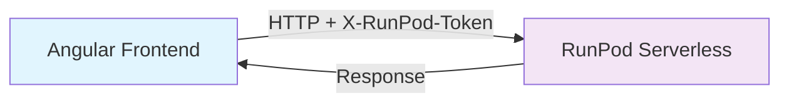

# 🚀 RunPod Token Setup - Frontend Configuration

## 📋 **Co to jest RunPod Token?**

RunPod token (`rpa_...`) to API key który autoryzuje frontend do komunikacji z RunPod Serverless endpoints. 

## ✅ **Token został dodany do frontendu!**

### **📍 Lokalizacja tokena:**
```typescript
// src/environments/environment.ts (Development)
runpodToken: 'rpa_4931AHFAX6HBQJ9N8GRMDKZMZJH4ZJ60SXDQY6UAaqlayf'

// src/environments/environment.prod.ts (Production)  
runpodToken: 'rpa_4931AHFAX6HBQJ9N8GRMDKZMZJH4ZJ60SXDQY6UAaqlayf'
```

### **🔧 Jak jest używany:**
- **HTTP Header**: `X-RunPod-Token` automatycznie dodawany do wszystkich API requests
- **Implementacja**: `ApiService.getHeaders()` method
- **Autoryzacja**: Pozwala frontendowi komunikować się z RunPod Serverless

## 🛡️ **Security Notes:**

### **✅ Bezpieczne (Local Development):**
- Token w `environment.ts` dla lokalnego developmentu ✓
- Nie commitowane do publicznego repo ⚠️

### **🔒 Production Deployment:**
Dla produkcji użyj environment variables:
```bash
# Build z environment variables
ng build --configuration=production \
  --env.RUNPOD_TOKEN=rpa_4931AHFAX6HBQJ9N8GRMDKZMZJH4ZJ60SXDQY6UAaqlayf
```

## 🚀 **Next Steps:**

1. **Test lokalne**: Frontend ready z tokenem ✅
2. **Deploy backend**: Na RunPod Serverless
3. **Update apiBaseUrl**: Zmień na RunPod endpoint URL
4. **Test production**: Pełna komunikacja frontend ↔ RunPod

## 📞 **API Communication Flow:**



### **Example HTTP Request:**
```typescript
// Automatycznie dodawane przez ApiService
headers: {
  'Content-Type': 'application/json',
  'X-RunPod-Token': 'rpa_4931AHFAX6HBQJ9N8GRMDKZMZJH4ZJ60SXDQY6UAaqlayf'
}
```

**🎯 Token jest już skonfigurowany i gotowy do użycia!** 